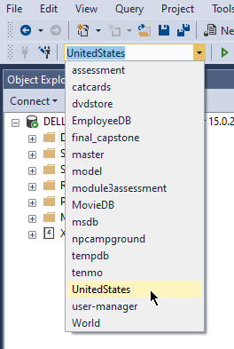

# Introduction to databases

The purpose of this exercise is to practice the important skill of analyzing data in databases using Structured Query Language (SQL).

## Learning objectives

After completing this exercise, you'll understand:

* How to write `SELECT` statements.
* How to filter data using `WHERE` clauses.
* How to execute mathematical expressions and string concatenation in SQL statements.
* How to filter data for `NULL` values.

## Evaluation criteria and functional requirements

* All of the queries run as expected.
* The number of results returned from your query equals the number of results specified in each question.
* The unit tests pass as expected.
* Code is clean, concise, and readable.

To complete this exercise, you need to write SQL queries in the files that are in the `Exercises` folder. You'll use the `UnitedStates` database as a source for all queries.

In each file, there's a commented out problem statement. Below it, write the query needed to solve the problem. The value immediately after the problem statement is the expected number of rows that the query must return.

## Getting started

1. If you haven't done so already, create the `UnitedStates` database. The script for this is available in this exercise folder—`create-UnitedStates-database.sql`.
2. Open the `Exercises` folder. Each file is numbered in suggested order of completion, but you can do them in any order you wish.
3. To start, double click any file to open it in SQL Server Management Studio (SSMS).
   1. Alternatively, you can open the folder of files in SSMS using the menu option **File > Open > Folder...**. Once you've done that, select **View > Solution Explorer** to display a window listing all the files.
4. The unit tests solution `IntroToDatabasesExercisesTests.sln` is in the same directory as this README. You can open it in Visual Studio and run the tests as you did in earlier exercises.

> Note: Make sure to save your changes to the SQL file before running the unit tests.

## Tips and tricks

* `SELECT` statements specify the columns of a table that you want to return from a query. While the values in the `SELECT` statement are usually directly mapped to a column name, you can also alias columns using the `AS` keyword.
* `WHERE` clauses filter results. Some operators you can use for filtering out data include:
    * `=`, `<>`, `!=`, `>`, `>=`, `<`, `<=`
    * `IN(values)`, `NOT IN(values)`
    * `BETWEEN value1 AND value2`
    * `IS NULL`, `IS NOT NULL`
    * `LIKE`, (with wildcard characters)
* You can combine multiple filter conditions using `AND` and `OR`.
* The `DISTINCT` clause removes duplicate values from the results.
* The SQL Server documentation includes a [tutorial for querying database tables][sql-server-how-to-query], as well as [documentation related to the `SELECT` statement][sql-server-select].
* If the IntelliSense in SSMS isn't recognizing the table or column names in your SQL code, or the results seem peculiar or unexpected, check that you have selected the `UnitedStates` database:

[sql-server-how-to-query]: https://docs.microsoft.com/en-us/sql/t-sql/lesson-1-creating-database-objects
[sql-server-select]: https://docs.microsoft.com/en-us/sql/t-sql/queries/from-transact-sql
